#  Global Population Data Pipeline

[](https://opensource.org/licenses/MIT)
[](https://www.python.org/downloads/)
[](https://www.docker.com/)

> Automated ETL pipeline for global population data with real-time streaming capabilities

## Overview

An automated ETL pipeline that extracts global population data from [Worldometers](https://www.worldometers.info/world-population/population-by-country/), processes it using Apache Airflow, and stores it in PostgreSQL, AWS S3, and BigQuery. Supports both batch processing and real-time streaming with Kafka.

## Architecture


## Deltailed Architecture

```mermaid
graph TB
    subgraph "Data Sources Layer"
        Worldometers["🌐 Worldometers<br/>population-by-country<br/>(HTML Table)"]
    end

    subgraph "Orchestration Layer"
        Airflow[" Apache Airflow<br/>DAG: population_data_pipeline<br/>Scheduler + Webserver + Workers<br/>Port 8080"]
    end

    subgraph "ETL / Processing Layer"
        Scraper["🐍 Web Scraper Task<br/>(BeautifulSoup + requests)"]
        Transformer[" Transform / Clean Task<br/>(Pandas / Python)"]
        LoaderPG["📥 PostgreSQL Loader"]
        LoaderS3["📤 S3 Uploader<br/>(Raw or Parquet)"]
        KafkaProducer["📤 Kafka Producer<br/>(Optional – batch → events)"]
    end

    subgraph "Event Backbone / Streaming Layer"
        Kafka["📨 Apache Kafka<br/>Port 9092<br/>Topic: population_updates"]
    end

    subgraph "Data Persistence Layer"
        Postgres[("🐘 PostgreSQL<br/>population_db<br/>Port 5432")]
        S3[("☁️ AWS S3<br/>Bucket: raw / processed / bronze<br/>Data Lake")]
    end

    subgraph "Monitoring Layer"
        Grafana["📈 Grafana<br/>Port 3000<br/>Dashboards + Metrics"]
    end

    Airflow -->|"Triggers & Schedules"| Scraper
    Airflow -->|"Triggers & Schedules"| Transformer
    Airflow -->|"Triggers & Schedules"| LoaderPG
    Airflow -->|"Triggers & Schedules"| LoaderS3

    Worldometers -->|"HTTP GET + Parse table<br/>(Country • Population 2025 • Yearly Change • ...)"| Scraper
    Scraper -->|"Raw structured rows"| Transformer
    Transformer -->|"Cleaned & typed records"| LoaderPG
    Transformer -->|"Parquet / CSV files"| LoaderS3
    LoaderPG -->|"SQL INSERT / UPSERT"| Postgres
    LoaderS3 -->|"PUT object"| S3

    Postgres -.->|"CDC (optional Debezium)"| Kafka
    Transformer -.->|"Publish delta (optional)"| KafkaProducer
    KafkaProducer -.-> Kafka

    Airflow -->|"Logs & Metrics"| Grafana
    Kafka -->|"Consumer lag & metrics"| Grafana
    Postgres -->|"Query stats"| Grafana
```



## Key Features

- **Web Scraping**: Automated data extraction using BeautifulSoup
- **Workflow Orchestration**: Apache Airflow for ETL automation
- **Data Storage**: PostgreSQL for transactional data, AWS S3 for data lake
- **Real-Time Streaming**: Kafka for event-driven data processing
- **Infrastructure as Code**: Terraform for AWS resource provisioning
- **Containerized**: Docker Compose for easy deployment

## Technology Stack

| Component | Technology |
|-----------|-----------|
| **Orchestration** | Apache Airflow |
| **Database** | PostgreSQL |
| **Streaming** | Apache Kafka |
| **Cloud Storage** | AWS S3 |
| **IaC** | Terraform |
| **Containers** | Docker & Docker Compose |
| **Monitoring** | Grafana |

## Prerequisites

- Docker & Docker Compose
- Python 3.8+
- AWS CLI (for S3 authentication)
- Git

## Quick Start

### 1. Clone Repository

```bash
git clone https://github.com/EbEmad/Global-Population-Data-Pipeline.git
cd Global-Population-Data-Pipeline
```

### 2. Configure Environment

Create a `.env` file with your credentials:

```env
# PostgreSQL
POSTGRES_USER=your_user
POSTGRES_PASSWORD=your_password
POSTGRES_DB=population_db

# Kafka
KAFKA_BROKER=kafka:9092

# AWS
AWS_ACCESS_KEY_ID=""
AWS_SECRET_ACCESS_KEY=""
AWS_DEFAULT_REGION=""
S3_BUCKET_NAME=""

# Airflow
AIRFLOW_UID=50000
```

### 3. Start Services

```bash
docker-compose up -d --build
```

### 4. Access Services

| Service | URL | Credentials |
|---------|-----|-------------|
| Airflow | http://localhost:8080 | admin / admin |
| Grafana | http://localhost:3000 | admin / admin |

## Usage

### Run Pipeline via Airflow UI
1. Open http://localhost:8080
2. Find `population_data_pipeline` DAG
3. Click "Trigger DAG"

### Run Pipeline via CLI
```bash
docker-compose exec airflow-webserver airflow dags trigger population_data_pipeline
```

### Query Data

**PostgreSQL:**
```bash
docker-compose exec postgres psql -U your_user -d population_db
```

